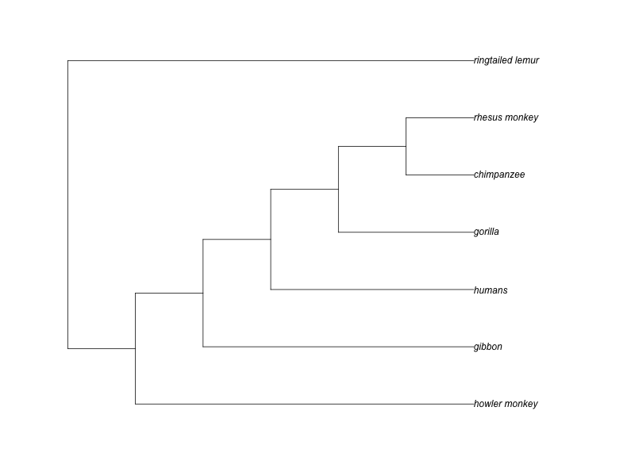
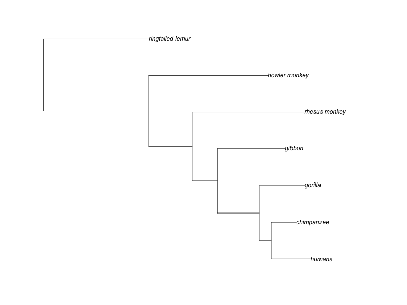

```{r}
source("reRoot.R")
library(phangorn)
library(patchwork)
```

```{r}
primates.dna <- read.dna("~/Documents/phylo/Exercise5/data/primates.raw.aligned.fasta",
                         format = "fasta"
)

primates.dna
```

## Estimating likelihood under JC69

```{r}
primates.phyDat <- phyDat(primates.dna,
                          type = "DNA", 
                          levels = NULL)

dm <- dist.dna(primates.dna, 
               model = "JC69")

treeNJ <- NJ(dm)
```

```{r}
fitJC <- pml(treeNJ, 
             data = primates.phyDat)

fitJC
```

**Question 1**: No; each based frequency is 0.25

**Question 2**: Since the base frequencies are the same, the transition rate for each nucleotide pair is also the same. $(C \to T) = 1$, and $(A \to G) = 1$

**Question 3**: The log likelihood for the JC model is `r fitJC$logLik`


```{r}
fitJCbranch <- optim.pml(fitJC, 
                         model = "JC")

fitJCbranch
```

**Question 4**: The log likelihood for the JC model is `r fitJCbranch$logLik`. The log likelihood of the model with optimized branch lengths is *slightly better* than that of our distance-based tree.

```{r}
rooted.tree <- reroot.tree(fitJC$tree, 
                           "ringtailed_lemur")

rooted.tree
```

```{r}
plot(rooted.tree)
```

## Estimating likelihood under F81

```{r}
fitF81branch <- optim.pml(fitJCbranch,
                          model = "F81")

fitF81branch

rooted.tree <- reroot.tree(fitF81branch$tree,
                           "ringtailed_lemur")

plot(rooted.tree)
```
**Question 6**: The base frequencies differ between nucleotides where A and C have a much higher frequency than T, which has a much higher frequency than G. A has the highest frequency, while G has the lowest frequency.

**Question 7**: The log likelihood for the F81 model is `r fitF81branch$logLik`, which is slightly better than the optimized JC model. 

## Estimating likelihood wuth GTR

```{r}
fitGTRbranch <- optim.pml(fitJCbranch, 
                          model = "GTR")

fitGTRbranch

rooted.tree <- reroot.tree(fitGTRbranch$tree,
                           "ringtailed_lemur")

png("alignment_GTR_tree.png", width = 800, height = 600)
plot(rooted.tree)
dev.off()
```

**Question 8**: The log likelihood for the GTR model is `r fitGTRbranch$logLik`, which is better than the F81 model. 

**Question 9**: The GTR model has the best log likelihood value. The GTR model is also the most complex. In this case, complexity seems to correlate with model performance because a more complex model is better at capturing the biological cimplexity that underlies processes like nucleotide base switching. 

**Question 10**: The topology of the GTR tree is different than the parsimony tree- the branches of the GTR tree have a variable length (which represents genetic difference), while the parsimony tree has equally distributed line lengths. Further, the inferred relationships in the GTR tree are slightly different. 



